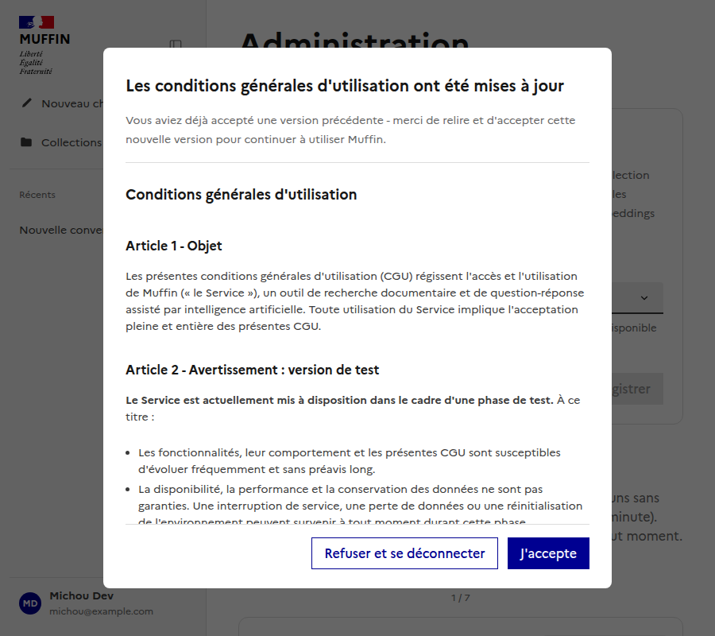
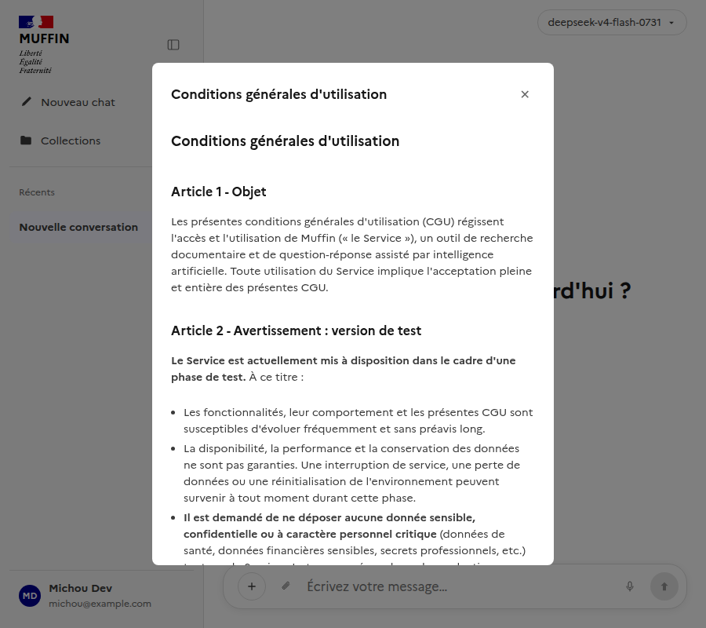
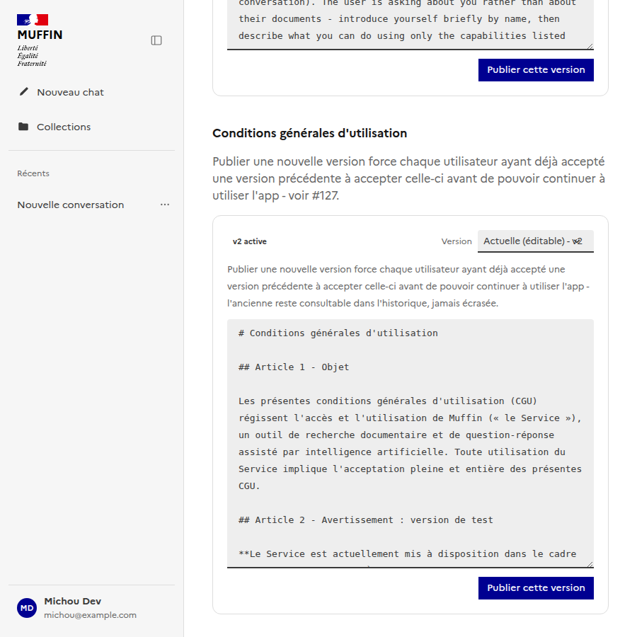

# CGU : acceptation obligatoire, versionnée (§127)

Documente le mécanisme d'acceptation obligatoire des CGU. Suit la même logique que
[`docs/ui/admin/`](../admin/README.md) - un sous-dossier par page/fonctionnalité.

Composants Vue : [`frontend/src/components/CguGateModal.vue`](../../../frontend/src/components/CguGateModal.vue)
(blocage obligatoire, non fermable - montée par `App.vue` tant que `status.accepted` est faux),
[`frontend/src/components/CguViewerModal.vue`](../../../frontend/src/components/CguViewerModal.vue)
(consultation libre depuis le menu utilisateur, sans blocage),
[`frontend/src/components/CguEditor.vue`](../../../frontend/src/components/CguEditor.vue) (admin,
intégré dans `AdminSettingsView.vue` - même pattern create-new-version + activate que
`PromptEditor.vue`, #96).
Composables : [`useCgu.ts`](../../../frontend/src/composables/useCgu.ts) (statut + acceptation),
[`useCguAdmin.ts`](../../../frontend/src/composables/useCguAdmin.ts) (gestion des versions).
Backend : `backend/app/models/cgu.py` (`CguVersion`, `CguAcceptance`), `backend/app/services/cgu_service.py`,
`backend/app/routers/cgu.py` (`GET /cgu/status`, `POST /cgu/accept`), `backend/app/routers/admin_cgu.py`.

## Mécanisme

- `App.vue` récupère `GET /api/cgu/status` dès qu'une session existe - si `accepted` est faux, la
  modale de blocage (`CguGateModal`) s'affiche par-dessus toute l'application, sans bouton fermer.
- `is_update` distingue un premier accès (`false`) d'une ré-acceptation après une mise à jour des
  CGU (`true`, l'utilisateur avait déjà accepté une version antérieure) - le texte affiché change
  en conséquence plutôt que de présenter systématiquement ça comme un premier accès.
- Publier une nouvelle version (admin) désactive l'ancienne et force chaque utilisateur qui
  l'avait acceptée à ré-accepter la nouvelle - jamais besoin de rattraper une version
  intermédiaire sautée, seule la version active actuelle compte.
- Chaque acceptation est tracée par utilisateur et par version (`CguAcceptance`, jamais
  supprimée), pour la transparence et une preuve en cas de besoin.

## Consultation libre

En dehors du blocage, le contenu de la version active reste consultable à tout moment depuis le
menu utilisateur ("Conditions d'utilisation"), sans déclencher de ré-acceptation :

## Administration

Même pattern que l'édition des prompts (#96) - créer une nouvelle version puis l'activer
séparément, jamais d'édition en place, historique complet consultable :

