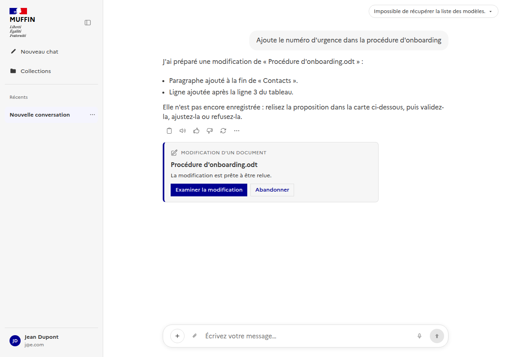
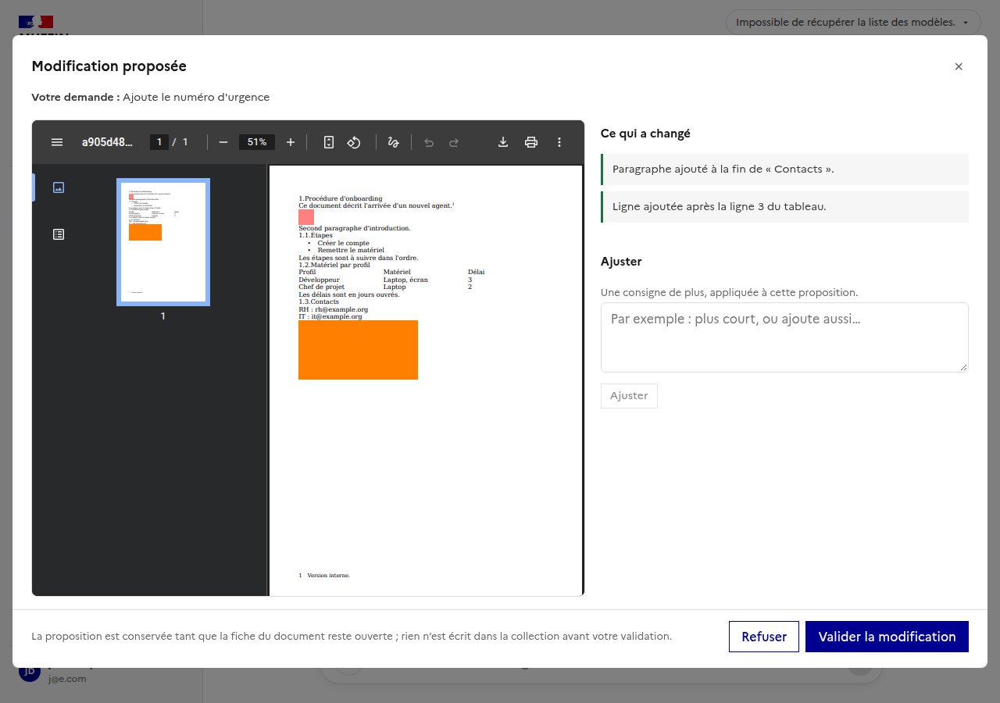
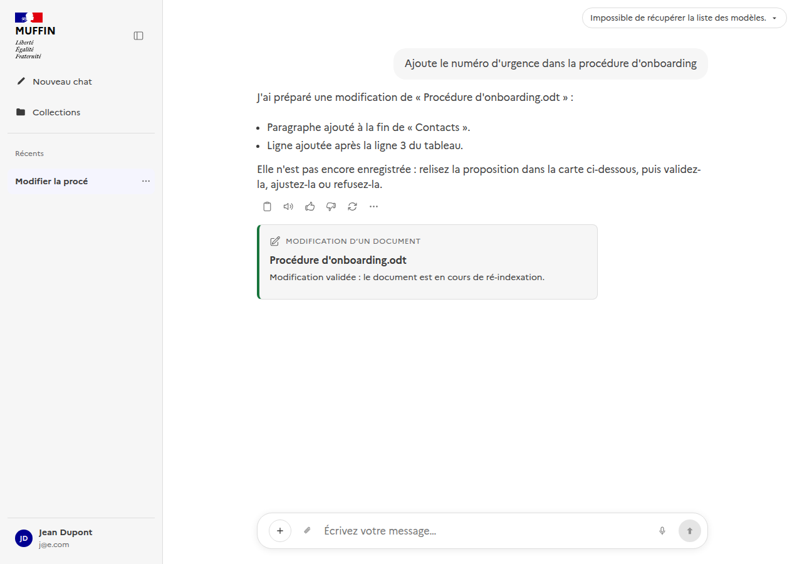
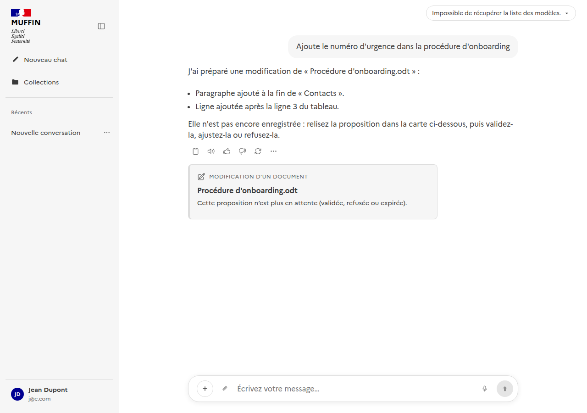

# Chat — accessibilité vocale (dictée + lecture à voix haute)

Documente les fonctionnalités vocales du chat (entrée par dictée, sortie par lecture à voix
haute), pour servir de référence à un agent capable d'interagir avec l'UI. Suit la même logique
que [`docs/ui/admin/`](../admin/README.md) - un sous-dossier par page/fonctionnalité.

Composants Vue : [`frontend/src/components/ChatWindow.vue`](../../../frontend/src/components/ChatWindow.vue)
(composer, dictée, raccourcis globaux), [`frontend/src/components/ChatMessage.vue`](../../../frontend/src/components/ChatMessage.vue)
(bouton de lecture par message).
Composables : [`useVoiceInput.ts`](../../../frontend/src/composables/useVoiceInput.ts) (dictée),
[`useVoiceOutput.ts`](../../../frontend/src/composables/useVoiceOutput.ts) (lecture à voix haute).
Utilitaire partagé : [`frontend/src/utils/plainText.ts`](../../../frontend/src/utils/plainText.ts)
(`toPlainText`) - convertit le markdown d'une réponse en texte lisible par une synthèse vocale
(retire tableaux/`` `code` ``/**gras**/citations `[1]`), utilisé à la fois par le bouton par
message et par le raccourci "lire le dernier message".

**Choix delibéré de fallback** (voir issues #108/#111) : `SpeechRecognition`/`speechSynthesis`
sont les API natives du navigateur, pas la solution définitive - suffisantes pour une première
itération (zéro backend, gratuit), une meilleure option (transcription/synthèse serveur) pourra
les remplacer plus tard si le rendu s'avère insuffisant en usage réel.

## Dictée vocale (entrée, issue #108)

Un bouton micro dans le composer permet de dicter un message au lieu de le taper, en s'appuyant
sur la transcription native du navigateur (Web Speech API - `SpeechRecognition`/
`webkitSpeechRecognition`), sans passer par un service de transcription côté serveur.

Voir [`screenshots/voice-input-idle.png`](screenshots/voice-input-idle.png) - bouton micro au repos,
juste avant le bouton d'envoi.

### Support navigateur

`SpeechRecognition` n'est bien supporté que sur Chrome/Edge desktop ; Firefox et Safari ne
l'implémentent pas. Le bouton micro (`.chat-window__mic`) n'est rendu du tout que si
`useVoiceInput().isSupported` est vrai (`v-if`, pas juste désactivé) - sur un navigateur non
supporté, il n'apparaît pas et un message de préconisation s'affiche à la place sous le composer
(`.chat-window__voice-hint`) : "La dictée vocale n'est pas disponible sur ce navigateur - utilisez
Google Chrome ou Microsoft Edge...".

### Utilisation (dictée)

- **Bouton micro** (`aria-pressed`, `aria-label` dynamique) : clic pour démarrer/arrêter la
  dictée. État actif visuellement distinct (fond rouge, icône qui pulse via CSS `animation`).
- **Raccourci clavier global : `Alt+Maj+V`** (`aria-keyshortcuts="Alt+Shift+V"` sur le bouton,
  mentionné dans son `title`/`aria-label`). Écouteur attaché sur `window` (pas seulement sur le
  textarea) - fonctionne depuis n'importe où dans la page, pas seulement quand le focus est dans
  le composer, pour qu'un utilisateur naviguant au clavier/lecteur d'écran puisse démarrer la
  dictée sans devoir d'abord tabuler jusqu'au champ de texte.
- Pendant l'écoute, le texte transcrit s'ajoute en direct au brouillon existant (résultats
  intermédiaires affichés au fur et à mesure, pas seulement à la fin d'une phrase) - il ne
  remplace jamais ce qui a déjà été tapé ou dicté avant.
- Erreur de permission micro refusée (ou tout autre échec de reconnaissance) : message d'erreur
  explicite dans le même emplacement que le message de préconisation
  (`.chat-window__voice-hint--error`, `role="alert"`), jamais un échec silencieux.

## Lecture à voix haute (sortie, issue #111)

Chaque réponse de l'assistant a un bouton "Lire à voix haute" dans sa barre d'actions
(`.chat-message__actions`, à côté de copier/👍/👎/régénérer), en plus d'un raccourci global pour
lire directement la dernière réponse. Utilise `speechSynthesis`/`SpeechSynthesisUtterance` -
support navigateur large (Chrome/Firefox/Safari/Edge), donc pas de message de préconisation
nécessaire ici, contrairement à la dictée.

Voir [`screenshots/voice-output-button.png`](screenshots/voice-output-button.png) - bouton haut-parleur
dans la barre d'actions d'une réponse, entre "Copier" et 👍.

### Utilisation (lecture)

- **Bouton par message** (`aria-pressed`, icône haut-parleur ↔ icône stop) : clic pour
  démarrer/arrêter la lecture de cette réponse précise. N'apparaît que si
  `useVoiceOutput().isSupported` est vrai.
- **Raccourci clavier global : `Alt+Maj+L`** ("Lire") : lit à voix haute la dernière réponse
  *complète* de la conversation (ignore un message encore `pending` ou en erreur - rien à lire).
  Même écouteur `window` que `Alt+Maj+V`, dans `ChatWindow.vue::handleGlobalKeydown` - fonctionne
  depuis n'importe où sur la page.
- **Une seule lecture à la fois** : démarrer une nouvelle lecture (bouton sur un autre message, ou
  raccourci) coupe systématiquement celle en cours (`window.speechSynthesis.cancel()`) - jamais
  deux voix qui se chevauchent. Appuyer sur le raccourci ou le bouton du message déjà en cours de
  lecture l'arrête (comportement toggle).
- Le markdown est nettoyé avant lecture via `toPlainText()` (voir plus haut) - tableaux, code,
  gras et citations `[1]` ne sont jamais lus tels quels.
- Changer de conversation, régénérer une réponse, ou tout autre démontage du composant du message
  en cours de lecture l'arrête proprement (`onBeforeUnmount`) - jamais une voix qui continue à
  lire un message qui n'est plus affiché.

## Modifier un document vivant depuis le chat (issue #171)

On peut demander une modification de la même façon qu'on pose une question : « ajoute le numéro d'urgence
dans la procédure d'onboarding ». L'agent de recherche reconnaît qu'il s'agit d'une modification et non
d'une recherche, **la confie à l'agent d'édition et attend son résultat**, puis répond avec ce que celui-ci
a conclu. Il ne modifie jamais rien lui-même. Composants :
[`ChatEditProposal.vue`](../../../frontend/src/components/ChatEditProposal.vue) (la carte),
[`DraftReviewModal.vue`](../../../frontend/src/components/DraftReviewModal.vue) (la fenêtre d'examen, la
même que dans l'onglet Révisions d'un document, voir [`../collections/README.md`](../collections/README.md)),
composable [`useDraftSession.ts`](../../../frontend/src/composables/useDraftSession.ts).

La proposition est **séparée de la réponse** : la réponse dit ce qui a changé, et dessous une carte à part
(filet bleu, intitulé « Modification d'un document », nom du document) est l'endroit où l'on relit la
proposition :

« Examiner la modification » ouvre la fenêtre d'examen - aperçu du document modifié, ce qui a changé,
images à déposer, champ « Ajuster », Valider / Refuser. Rien n'est écrit dans la collection avant la
validation :

**Valider** depuis la carte crée la révision suivante du document, qui est ré-indexé :

La carte reflète l'état **réel** de la proposition, lu auprès du backend, pas un instantané de la réponse :
elle se recharge avec la conversation, et si la proposition a été validée, refusée ou a expiré entre-temps
elle le dit au lieu de proposer une action qui n'existe plus :

Autres états de la carte : en préparation (si l'attente de l'agent a été dépassée, la fenêtre ne s'ouvre pas
d'elle-même au milieu de la conversation - la carte change simplement d'état), « n'a rien modifié » quand
l'agent d'édition ne pouvait pas faire la demande, et l'échec avec son motif.

Quand le message ne désigne pas assez clairement un seul document, l'agent demande lequel au lieu de
deviner ; s'il n'y a rien que l'utilisateur puisse modifier, ou si le message n'a rien d'une modification,
le run continue comme une question normale.

**Qui peut modifier** : le propriétaire de la collection, ou un administrateur de la plateforme - mais un
administrateur seulement sur une collection qu'il peut déjà voir (la sienne, publique, ou partagée avec
lui), jamais sur la collection privée de quelqu'un d'autre. Un document visible mais non modifiable est
refusé avec un message explicite. La règle est décidée côté backend à partir de l'identité du run et
s'applique partout : fiche du document, chat, remplacement, restauration, propositions.

Les réponses de recherche qui citent un document vivant indiquent **la révision** dont elles sont tirées
(« Révision 3 » sur la source). Une proposition non validée n'est jamais indexée, donc jamais citée.

## Comportement notable pour un agent qui pilote l'UI

- Le clic ou le raccourci de dictée ne fait *que* démarrer/arrêter la capture micro - il n'envoie
  jamais le message automatiquement. L'envoi reste un geste explicite (bouton "Envoyer" ou
  Entrée).
- `SpeechRecognition.start()` déclenche la demande de permission micro du navigateur si elle n'a
  pas encore été accordée pour l'origine - dans un contexte automatisé (Playwright/CDP), il faut
  accorder la permission au préalable (`context.grantPermissions(['microphone'], { origin })`) et
  lancer Chrome avec `--use-fake-ui-for-media-stream --use-fake-device-for-media-stream` pour
  éviter un prompt bloquant et simuler un micro.
- `speechSynthesis` n'a besoin d'aucune permission navigateur (contrairement au micro) - un agent
  automatisé peut déclencher la lecture sans configuration préalable de contexte.
