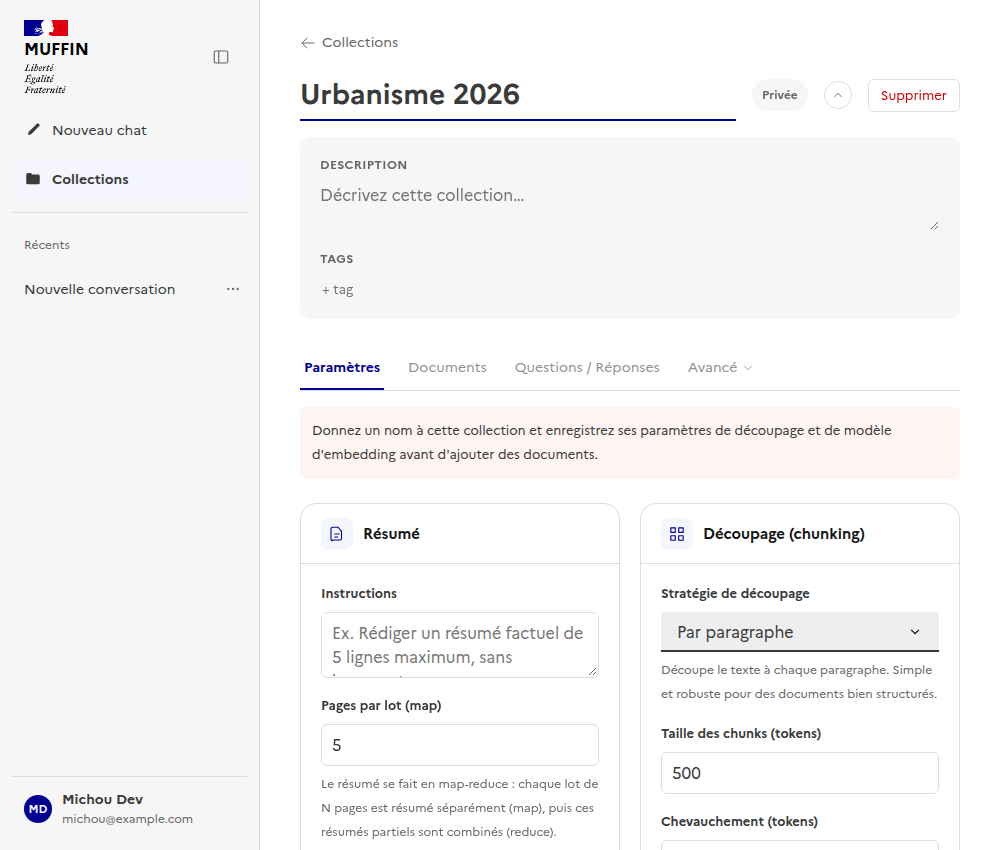
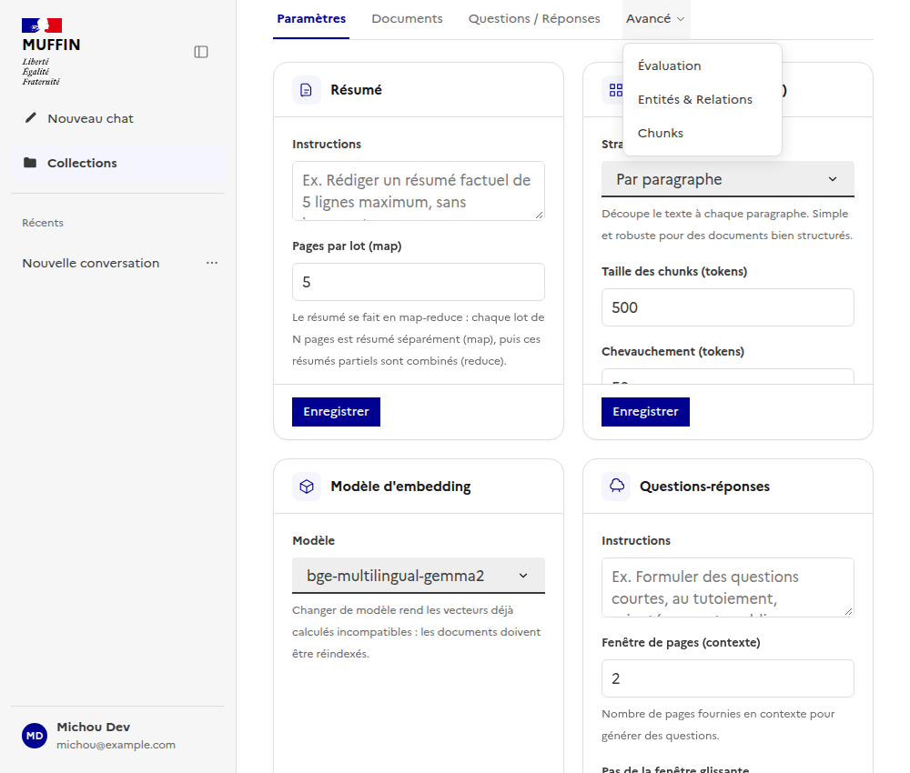
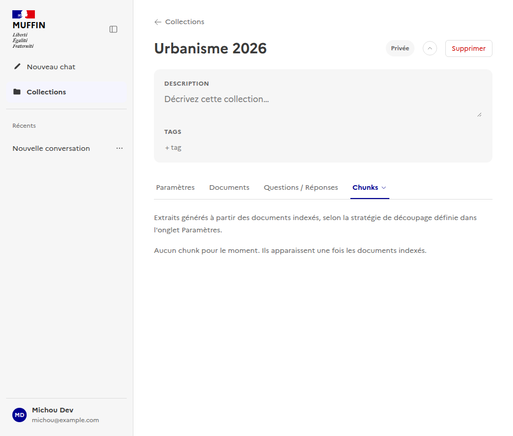
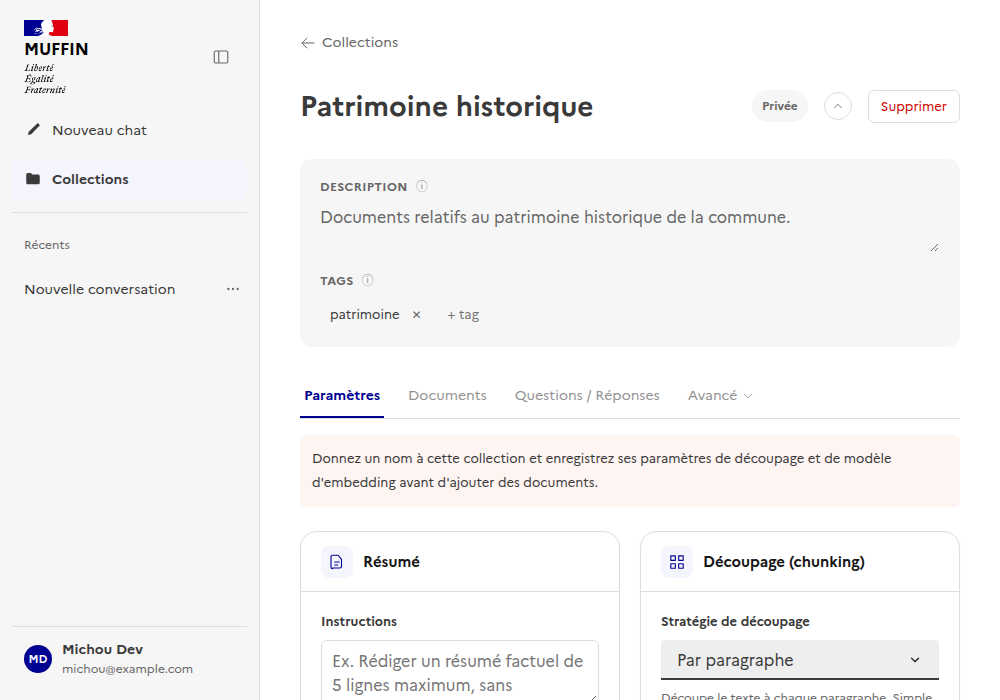
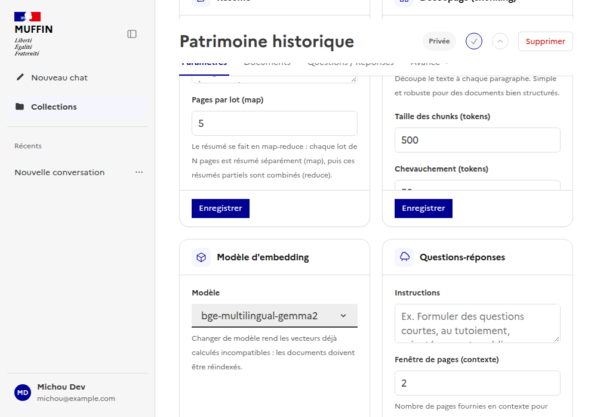

# Collections : liste et fiche détail

Documente la gestion des collections de documents - point d'entrée principal pour organiser les
documents que l'agent de recherche pourra citer. Suit la même logique que
[`docs/ui/admin/`](../admin/README.md) - un sous-dossier par page/fonctionnalité.

Composants Vue : [`frontend/src/components/CollectionsView.vue`](../../../frontend/src/components/CollectionsView.vue)
(liste, recherche, tri), [`frontend/src/components/CollectionDetailView.vue`](../../../frontend/src/components/CollectionDetailView.vue)
(fiche détail : header, description/tags, onglets Paramètres/Documents/Questions-Réponses/Évaluation/Entités
& Relations/Chunks).
Composable : [`useCollections.ts`](../../../frontend/src/composables/useCollections.ts).

## Liste des collections

Recherche par nom/tag, tri (dernière mise à jour, nom, nombre de documents), pagination :

## Fiche détail : header (§140)

Le header (nom, badge de visibilité, actions) reste sur une seule ligne. Description et tags sont
regroupés dans un bloc secondaire distinct, repliable via le chevron à côté du badge de visibilité,
ouvert par défaut pour ne rien cacher au premier accès. Les dates de dernière modification
("Modifié par... le...") ne sont plus affichées en permanence : elles apparaissent au survol/focus
de l'icône ⓘ à côté de chaque label ("Description", "Tags").

## Onglets : hiérarchie premier niveau / avancé (§141)

Seuls Paramètres, Documents et Questions/Réponses restent au premier niveau - l'essentiel pour un
usage courant. Évaluation du retrieval, Entités & Relations et Chunks (vues d'analyse/debug) sont
regroupées sous un menu déroulant "Avancé" :

Sélectionner un onglet avancé change le libellé du déclencheur ("Avancé" → "Chunks" par exemple)
et le garde surligné comme actif - les URLs par onglet (`/collections/:id/chunks`,
`/collections/:id/relations`, `/collections/:id/evaluation`) restent inchangées, donc les liens
existants continuent de fonctionner :

Tant que les paramètres de la collection n'ont pas été enregistrés, seul l'onglet Paramètres est
accessible (les autres onglets et le menu Avancé restent désactivés).

## Mode lecture/édition, header collant, transitions (§142)

Le nom, la description et les tags ne sont plus éditables en permanence : un bouton "Modifier"
(icône crayon, à côté du chevron de repli) bascule vers un mode édition explicite, qui redevient
un simple bouton "Terminé" (icône coche) tant qu'il est actif. Tant que la collection n'est pas
prête (nom par défaut, paramètres jamais enregistrés), le mode édition reste forcé ouvert - l'owner
peut nommer sa collection sans clic préalable :

Une fois la collection prête, le mode lecture est celui par défaut au chargement suivant - nom,
description et tags s'affichent en texte statique, sans bouton de suppression de tag ni champ
d'ajout :

Cliquer sur "Modifier" ré-active les champs éditables :

Le nom et la barre d'onglets restent visibles au défilement (`position: sticky`) - le bloc
description/tags, lui, défile normalement et disparaît sous le header une fois qu'on descend dans
le contenu d'un onglet. Le changement d'onglet anime un léger fondu plutôt qu'un remplacement brut
du panneau.
