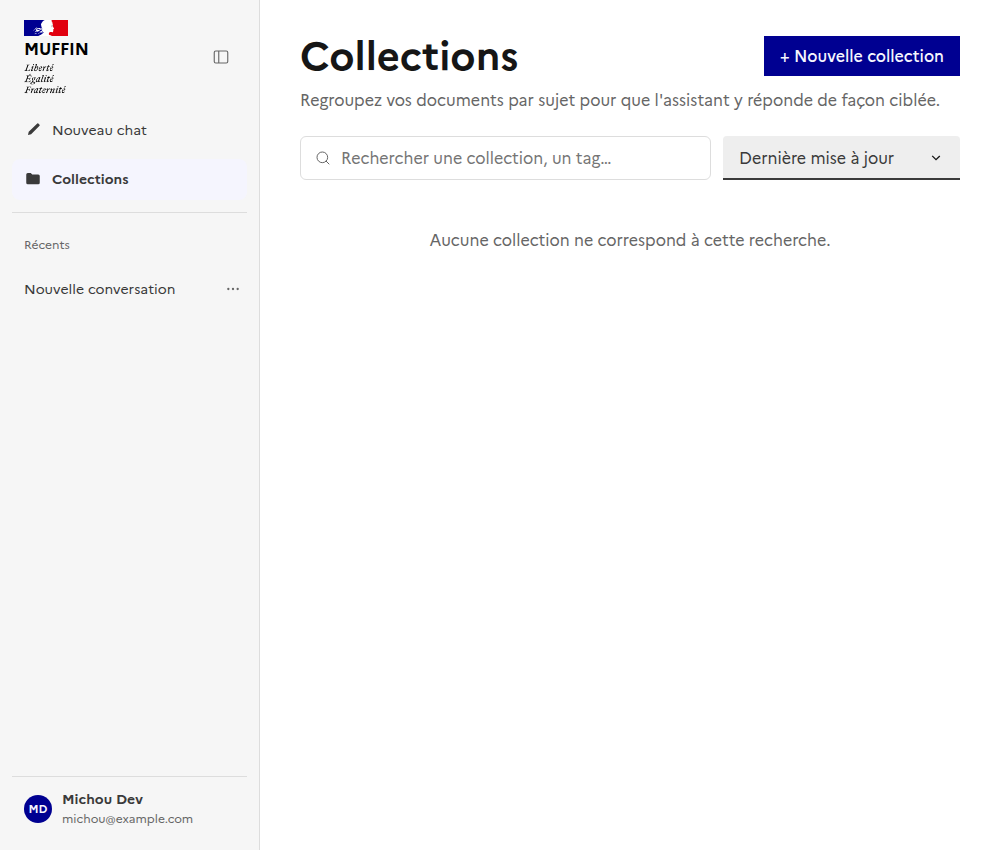
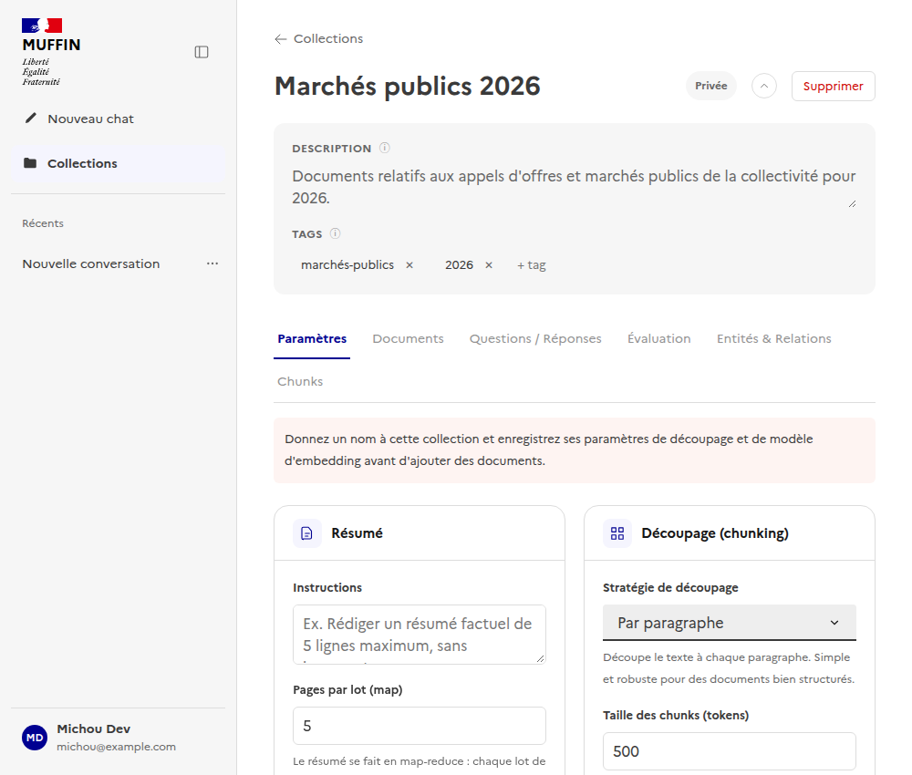
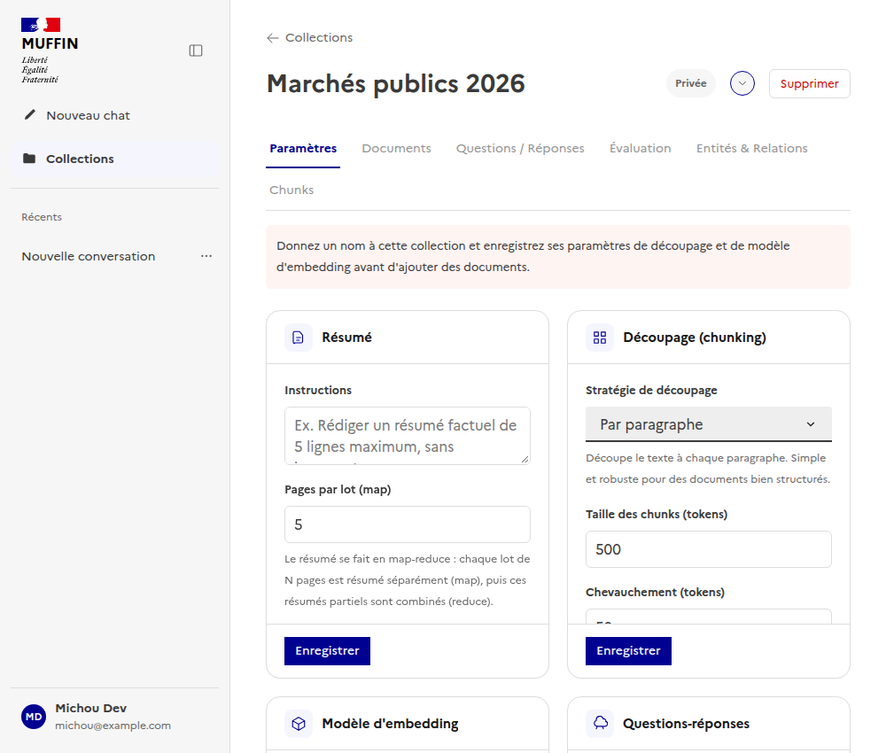

# Collections : liste et fiche détail

Documente la gestion des collections de documents - point d'entrée principal pour organiser les
documents que l'agent de recherche pourra citer. Suit la même logique que
[`docs/ui/admin/`](../admin/README.md) - un sous-dossier par page/fonctionnalité.

Composants Vue : [`frontend/src/components/CollectionsView.vue`](../../../frontend/src/components/CollectionsView.vue)
(liste, recherche, tri), [`frontend/src/components/CollectionDetailView.vue`](../../../frontend/src/components/CollectionDetailView.vue)
(fiche détail : header, description/tags, onglets Paramètres/Documents/Questions-Réponses/Évaluation/Entités
& Relations/Chunks).
Composable : [`useCollections.ts`](../../../frontend/src/composables/useCollections.ts).

## Liste des collections

Recherche par nom/tag, tri (dernière mise à jour, nom, nombre de documents), pagination :

## Fiche détail : header (§140)

Le header (nom, badge de visibilité, actions) reste sur une seule ligne. Description et tags sont
regroupés dans un bloc secondaire distinct, repliable via le chevron à côté du badge de visibilité
- replié par défaut au chargement suivant si l'utilisateur l'a refermé, sinon ouvert par défaut
pour ne rien cacher au premier accès. Les dates de dernière modification ("Modifié par... le...")
ne sont plus affichées en permanence : elles apparaissent au survol/focus de l'icône ⓘ à côté de
chaque label ("Description", "Tags").

## Onglets

Paramètres (découpage, résumé, modèle d'embedding, visibilité/partages - owner uniquement),
Documents, Questions/Réponses, Évaluation du retrieval, Entités & Relations, Chunks. Tant que les
paramètres de la collection n'ont pas été enregistrés, seul l'onglet Paramètres est accessible.
