# Collections : liste et fiche détail

Documente la gestion des collections de documents - point d'entrée principal pour organiser les
documents que l'agent de recherche pourra citer. Suit la même logique que
[`docs/ui/admin/`](../admin/README.md) - un sous-dossier par page/fonctionnalité.

Composants Vue : [`frontend/src/components/CollectionsView.vue`](../../../frontend/src/components/CollectionsView.vue)
(liste, recherche, tri), [`frontend/src/components/CollectionDetailView.vue`](../../../frontend/src/components/CollectionDetailView.vue)
(fiche détail : header, description/tags, onglets Paramètres/Documents/Questions-Réponses/Évaluation/Entités
& Relations/Chunks).
Composable : [`useCollections.ts`](../../../frontend/src/composables/useCollections.ts).

## Liste des collections

Recherche par nom/tag, tri (dernière mise à jour, nom, nombre de documents), pagination :

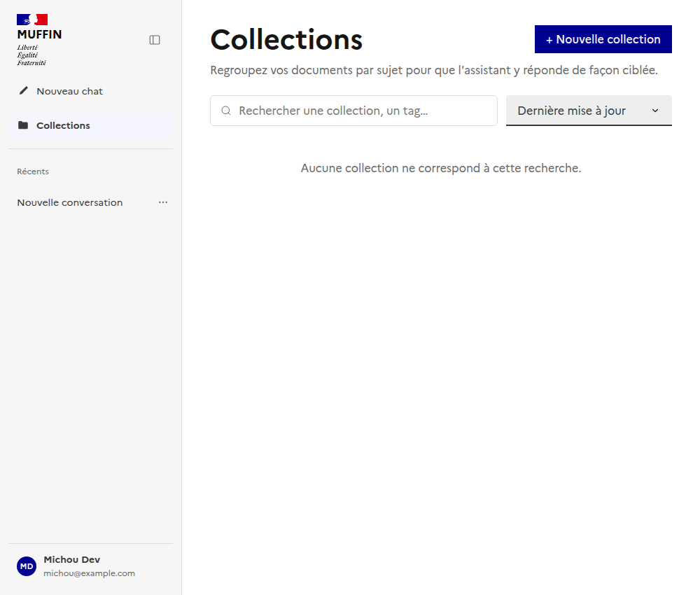

## Fiche détail : header (§140)

Le header (nom, badge de visibilité, actions) reste sur une seule ligne. Description et tags sont
regroupés dans un bloc secondaire distinct, repliable via le chevron à côté du badge de visibilité,
ouvert par défaut pour ne rien cacher au premier accès. Les dates de dernière modification
("Modifié par... le...") ne sont plus affichées en permanence : elles apparaissent au survol/focus
de l'icône ⓘ à côté de chaque label ("Description", "Tags").

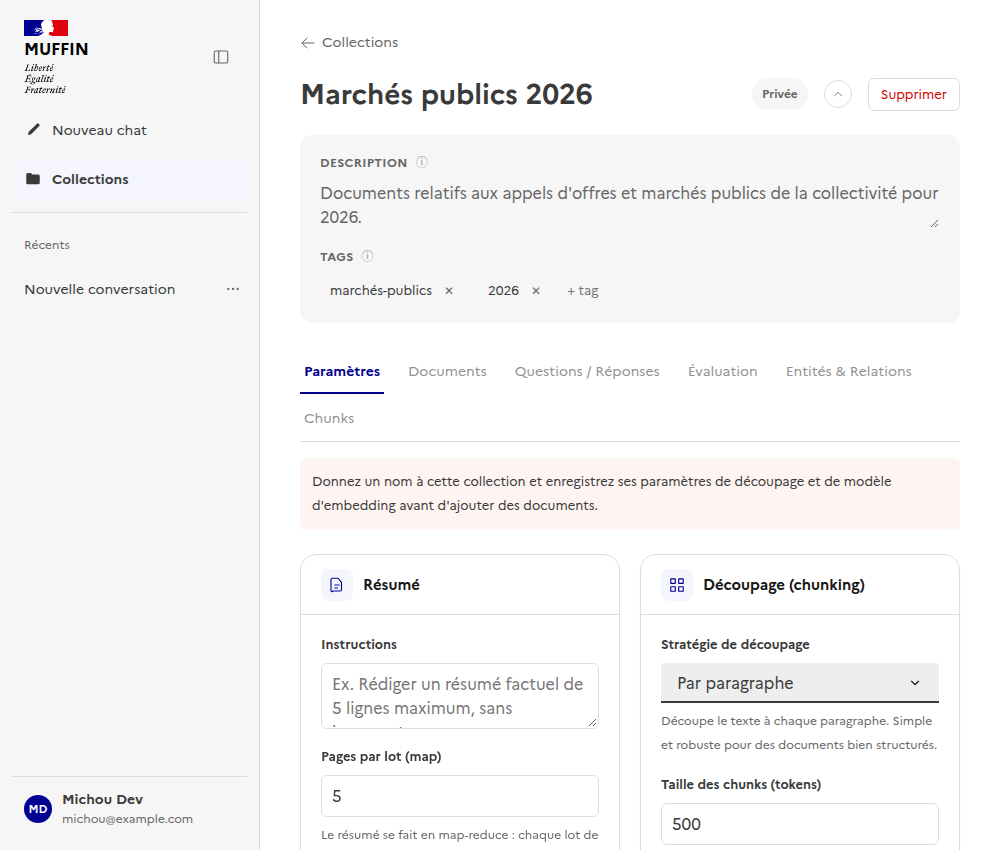

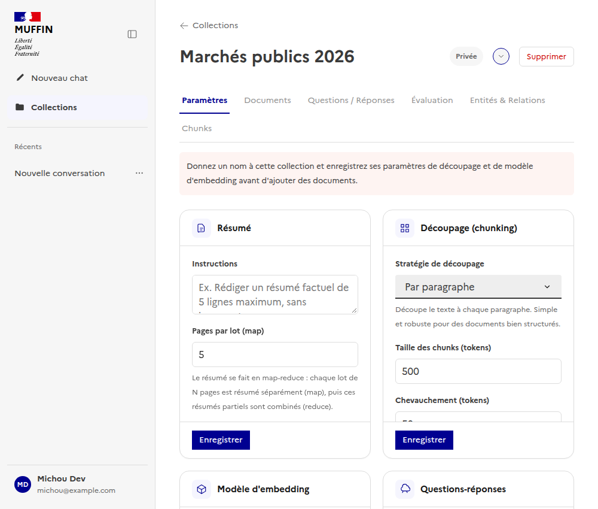

## Onglets : hiérarchie premier niveau / avancé (§141)

Seuls Paramètres, Documents et Questions/Réponses restent au premier niveau - l'essentiel pour un
usage courant. Évaluation du retrieval, Entités & Relations et Chunks (vues d'analyse/debug) sont
regroupées sous un menu déroulant "Avancé" :

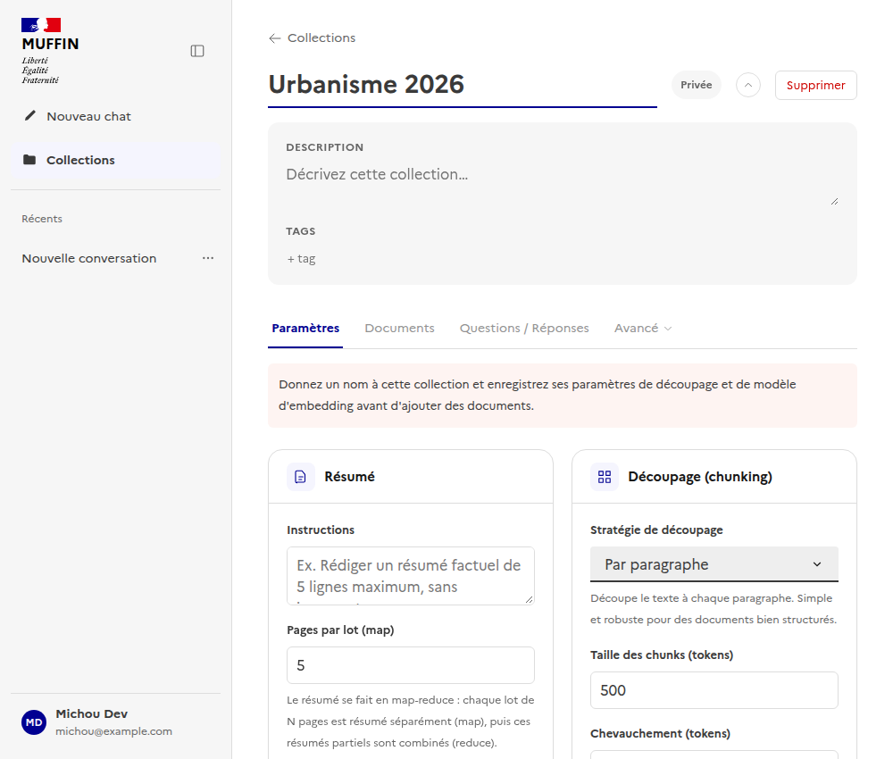

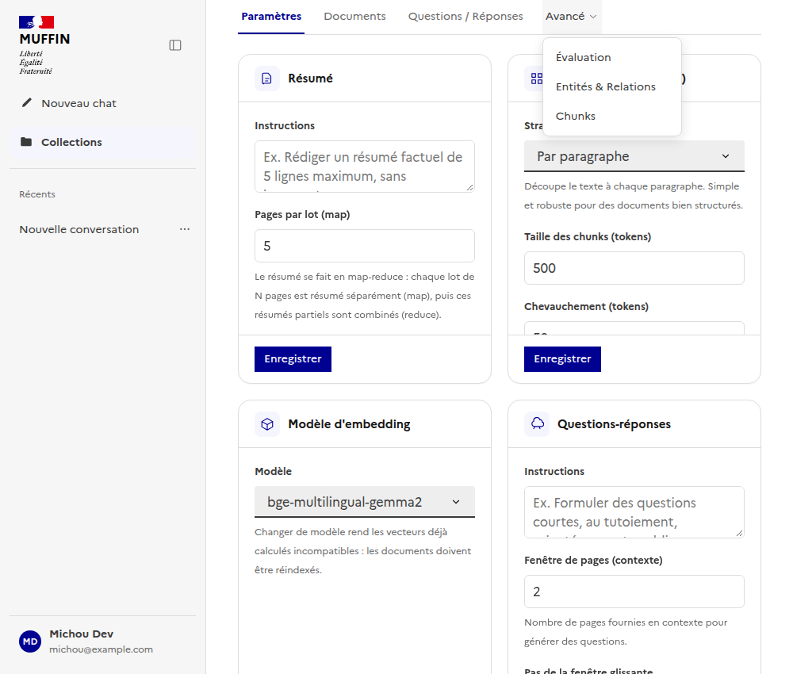

Sélectionner un onglet avancé change le libellé du déclencheur ("Avancé" → "Chunks" par exemple)
et le garde surligné comme actif - les URLs par onglet (`/collections/:id/chunks`,
`/collections/:id/relations`, `/collections/:id/evaluation`) restent inchangées, donc les liens
existants continuent de fonctionner :

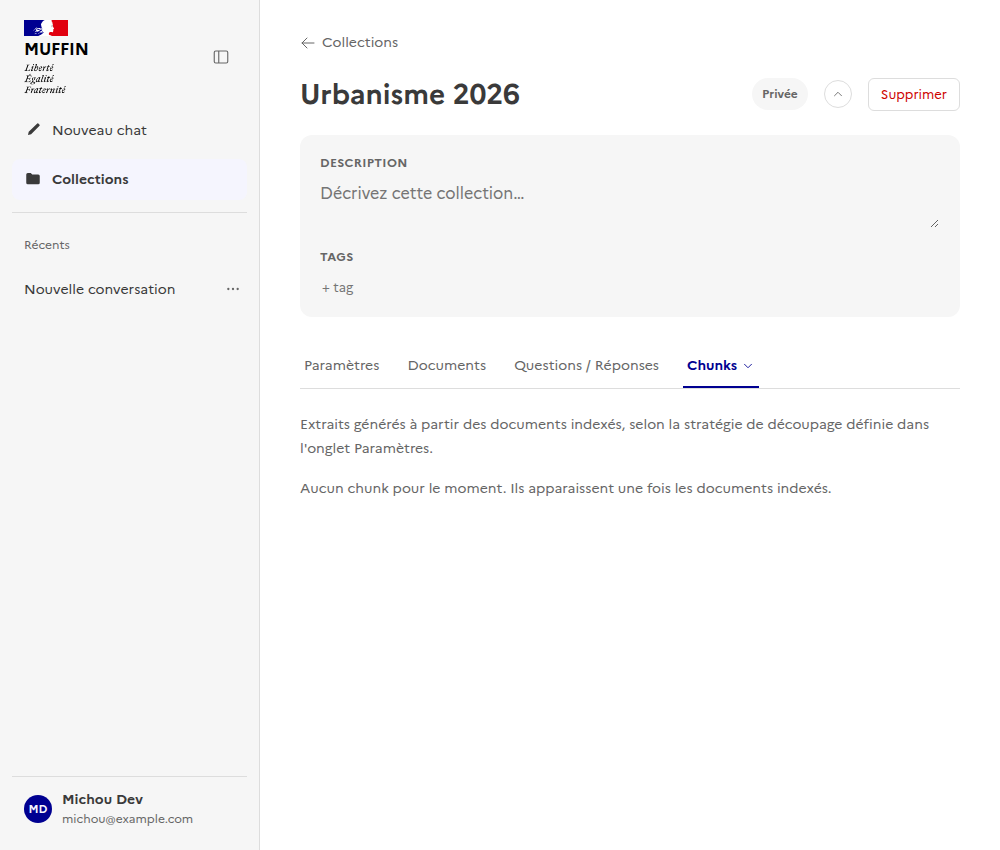

Tant que les paramètres de la collection n'ont pas été enregistrés, seul l'onglet Paramètres est
accessible (les autres onglets et le menu Avancé restent désactivés).

## Mode lecture/édition, header collant, transitions (§142)

Le nom, la description et les tags ne sont plus éditables en permanence : un bouton "Modifier"
(icône crayon, à côté du chevron de repli) bascule vers un mode édition explicite, qui redevient
un simple bouton "Terminé" (icône coche) tant qu'il est actif. Tant que la collection n'est pas
prête (nom par défaut, paramètres jamais enregistrés), le mode édition reste forcé ouvert - l'owner
peut nommer sa collection sans clic préalable :

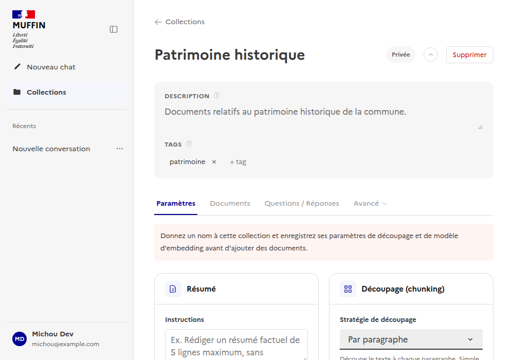

Une fois la collection prête, le mode lecture est celui par défaut au chargement suivant - nom,
description et tags s'affichent en texte statique, sans bouton de suppression de tag ni champ
d'ajout :

Cliquer sur "Modifier" ré-active les champs éditables :

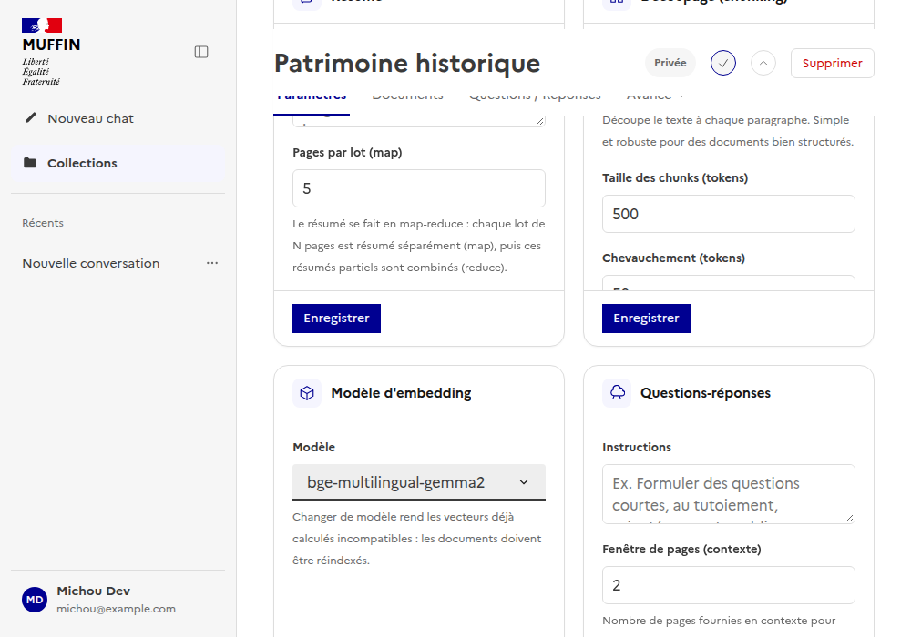

Le nom et la barre d'onglets restent visibles au défilement (`position: sticky`) - le bloc
description/tags, lui, défile normalement et disparaît sous le header une fois qu'on descend dans
le contenu d'un onglet. Le changement d'onglet anime un léger fondu plutôt qu'un remplacement brut
du panneau.

## Documents vivants (§172)

Un **document vivant** est un fichier ODT ou Markdown qui évolue dans le temps : au lieu de le
supprimer puis de le ré-uploader (et de perdre résumé, tags et identité), on le **remplace** par une
nouvelle version, avec un historique de révisions. Réservé au propriétaire de la collection, comme
toute action d'écriture. Composants :
[`CollectionDocumentsTab.vue`](../../../frontend/src/components/CollectionDocumentsTab.vue),
[`LivingDocumentRevisions.vue`](../../../frontend/src/components/LivingDocumentRevisions.vue),
composable [`useLivingDocuments.ts`](../../../frontend/src/composables/useLivingDocuments.ts).

Dans l'onglet Documents, le bouton "Ajouter un document vivant" n'accepte que des fichiers `.odt` ou
`.md` ; un document vivant porte le badge "Document vivant" dans la liste :

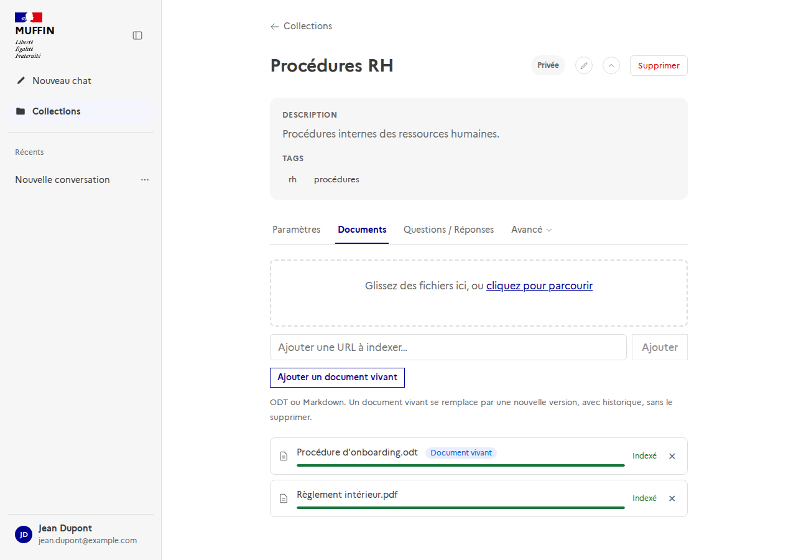

"Créer un document Markdown" permet d'écrire un document de zéro (nom + contenu), sans fichier à
uploader. Le nom reçoit l'extension `.md` si elle manque, nom et contenu ne peuvent pas être vides, et
la première révision est marquée comme écrite dans l'interface :

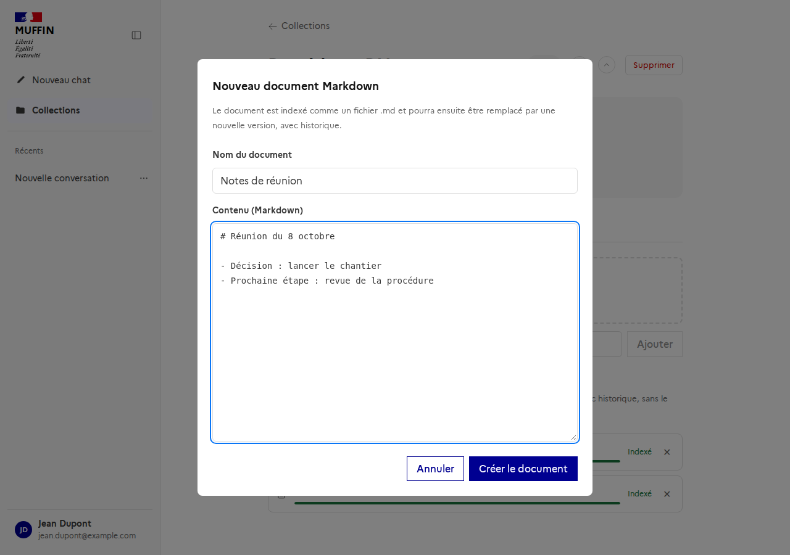

Sa fiche détail a un onglet **Révisions** supplémentaire : historique (origine, auteur, date), badge
"Courante", bouton "Remplacer par une nouvelle version" (le fichier doit être de même format),
"Télécharger" (la version courante, ou n'importe quelle révision - le fichier est servi par le backend,
jamais par une URL de stockage directe) et "Restaurer" sur une ancienne révision - restaurer ajoute une nouvelle révision, l'historique n'est
jamais réécrit. Chaque écriture ré-indexe ce seul document :

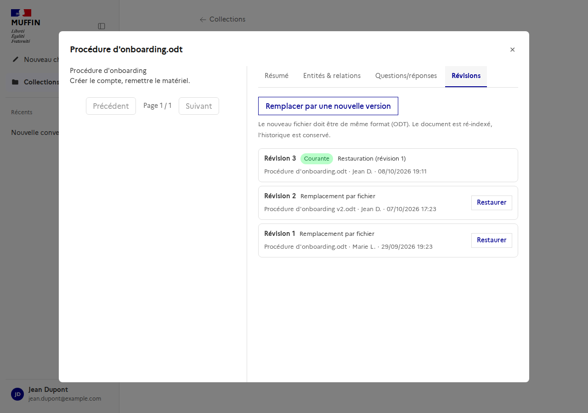

Pendant qu'une autre personne (ou une autre session du même compte) modifie le document, un
bandeau l'indique avec l'heure d'expiration du verrou, et les actions d'écriture sont désactivées.
Le panneau se rafraîchit toutes les 10 secondes :

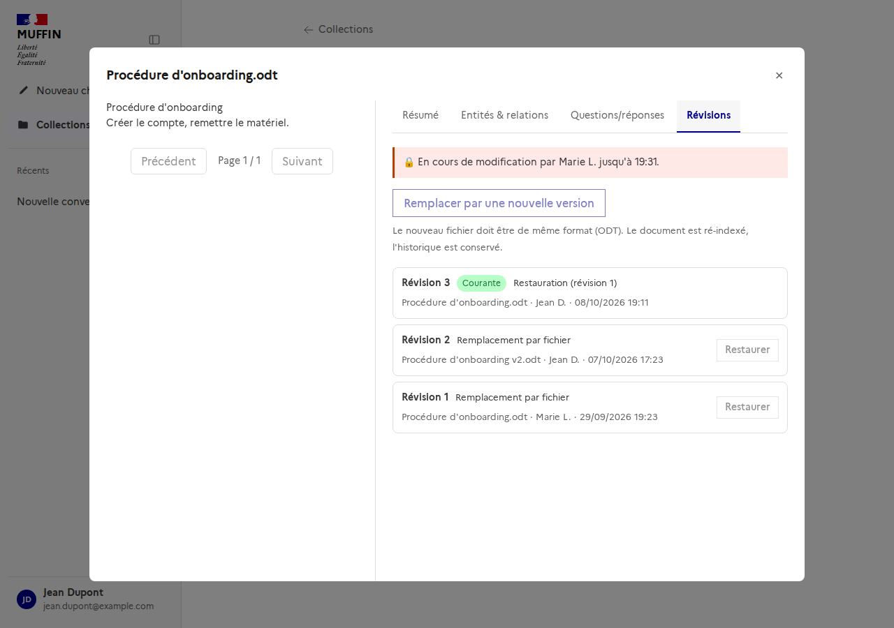

Une écriture prend le verrou, envoie la révision affichée (`base_revision`) et son jeton, puis le
relâche ; si le document a été modifié entre-temps ou si le verrou a expiré, l'écriture est refusée
avec un message explicite et l'historique est rechargé.
