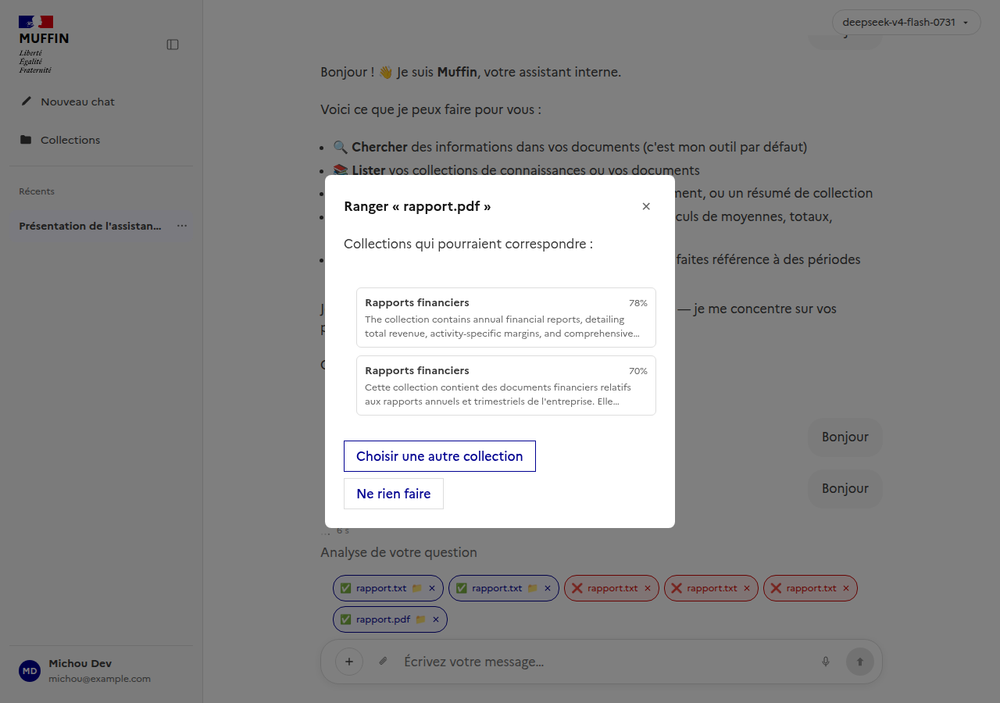
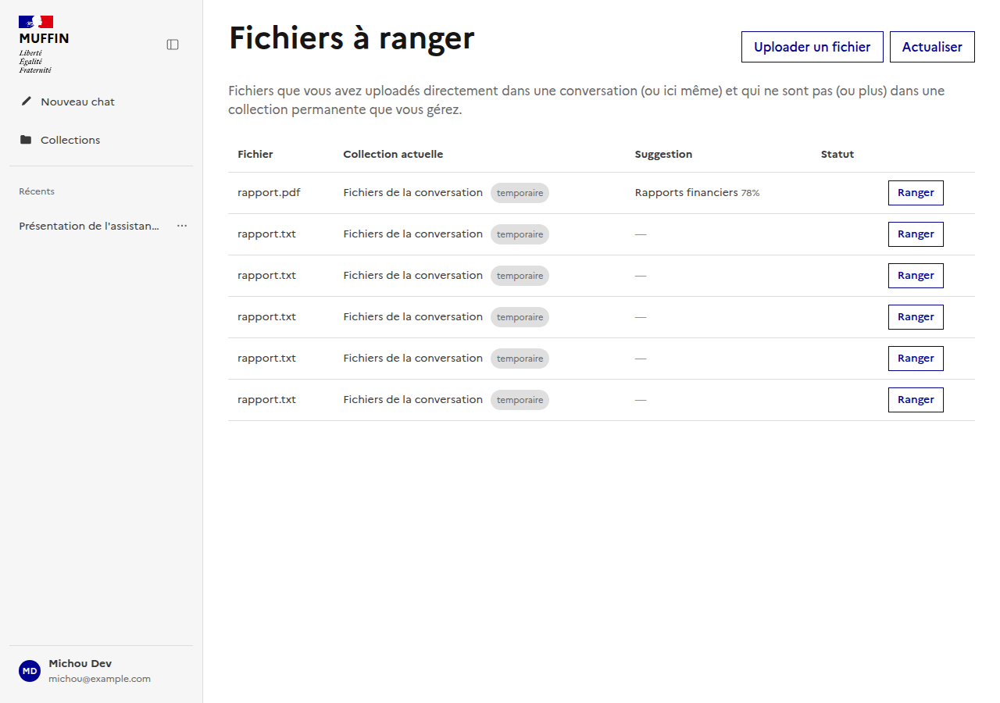
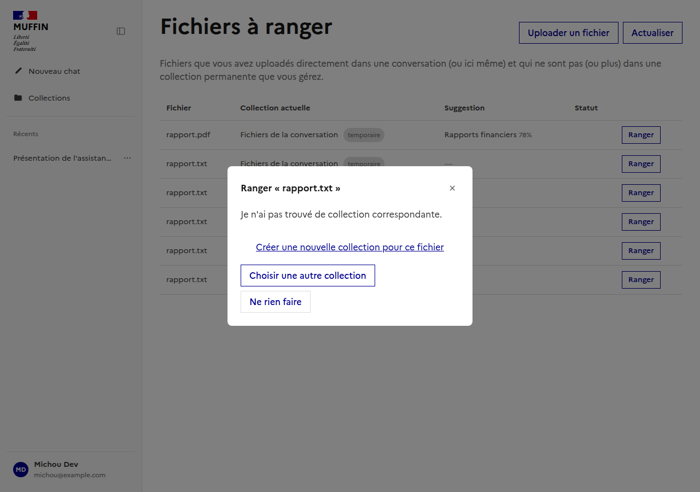

# Suggestion de rangement des fichiers uploadés dans le chat (§122)

Documente la fonctionnalité de suggestion de rangement d'un fichier uploadé directement dans une
conversation (§ conv-files, #88/#89/#90/#91/#92) vers une collection permanente. Suit la même
logique que [`docs/ui/admin/`](../admin/README.md) - un sous-dossier par page/fonctionnalité.

Composants Vue : [`frontend/src/components/FileFilingModal.vue`](../../../frontend/src/components/FileFilingModal.vue)
(modale de décision, réutilisée par le chat et la page dédiée),
[`frontend/src/components/FilingReviewView.vue`](../../../frontend/src/components/FilingReviewView.vue)
(page "Fichiers à ranger", `/filing`), [`frontend/src/components/ChatWindow.vue`](../../../frontend/src/components/ChatWindow.vue)
(badge de notification sur le chip de fichier).
Composable : [`useFiling.ts`](../../../frontend/src/composables/useFiling.ts).
Backend : `backend/app/routers/filing.py`, `backend/app/services/document_service.py::suggest_filing`
(calcul de la suggestion, déclenché best-effort par le worker à la fin de `summarize_document`),
`backend/app/services/document_upload_service.py::decide_filing`/`upload_standalone_for_filing`.

## Mécanisme

Une fois le résumé d'un fichier prêt, son embedding est comparé à la description de chaque
collection que l'uploadeur possède (index Meilisearch de #124) - les `FILING_TOP_K = 5`
meilleures correspondances sont conservées sur le document (`Document.filing_candidates`, une
photo figée pour comparer plus tard "ce qui a été suggéré" à "ce qui a été choisi").

## Suggestion dans le chat

Une fois l'analyse terminée, le chip du fichier affiche une notification (📁) - cliquer dessus
ouvre une modale listant les collections candidates, chacune avec son score et sa propre
description comme "pourquoi" :

## Page dédiée "Fichiers à ranger"

Accessible depuis le menu utilisateur, liste tous les fichiers d'un utilisateur pas encore rangés
dans une collection permanente qu'il contrôle - avec un bouton pour uploader un fichier
directement ici, sans passer par une conversation :

## Aucune correspondance convaincante

Si aucune collection ne correspond, ou si le meilleur score reste faible, un lien pré-rempli
propose de créer une nouvelle collection pour ce fichier plutôt que de forcer un choix :

Dans tous les cas, c'est l'utilisateur qui valide - "Ne rien faire" laisse le fichier dans sa
collection temporaire, exactement comme avant cette fonctionnalité.
