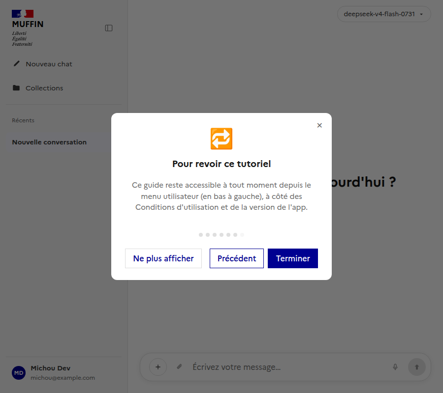
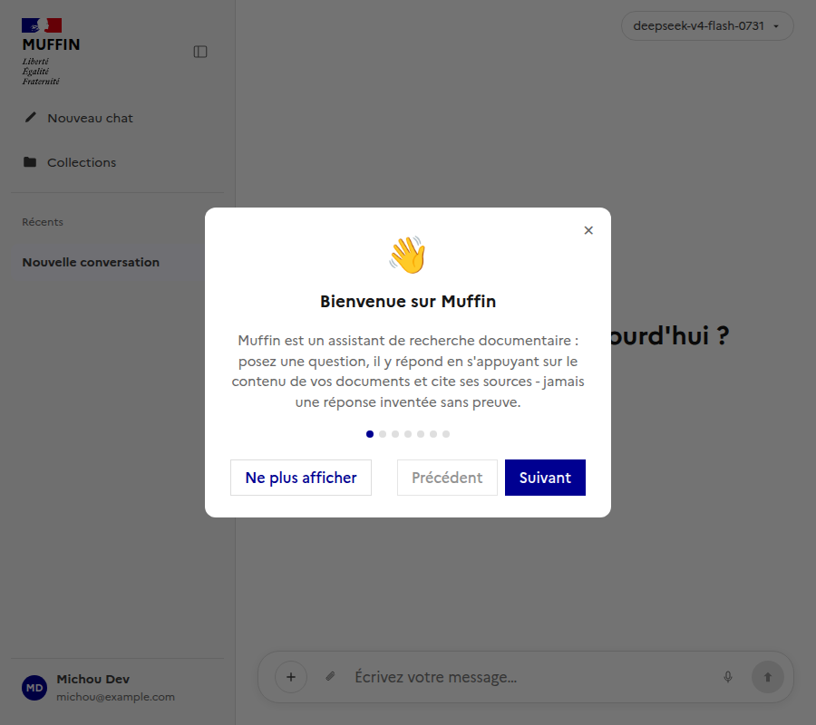

# Onboarding : tutoriel de découverte (§135)

Documente le tutoriel de découverte affiché aux nouveaux utilisateurs. Suit la même logique que
[`docs/ui/admin/`](../admin/README.md) - un sous-dossier par page/fonctionnalité.

Composant Vue : [`frontend/src/components/OnboardingModal.vue`](../../../frontend/src/components/OnboardingModal.vue)
(carrousel de 7 étapes, dismissible).
Composable : [`frontend/src/composables/useOnboarding.ts`](../../../frontend/src/composables/useOnboarding.ts)
(état partagé `showTutorial`/`dismissedForever`, persistance `localStorage` - préférence
purement liée au navigateur, jamais synchronisée côté backend, même logique que
`ChatSidebar.vue`'s `COLLAPSE_STORAGE_KEY`).

## Mécanisme

- `App.vue` ouvre automatiquement le tutoriel une fois par navigateur, seulement après connexion
  **et** acceptation des CGU (§127) - jamais avant ou en même temps que la modale de blocage CGU,
  et jamais deux fois dans la même session une fois fermé.
- Chaque étape correspond à une fonctionnalité réelle de l'app (collections, citations, upload de
  fichier direct en conversation, recherche web, raccourcis d'accessibilité) plutôt qu'un texte
  générique.
- "Ne plus afficher" (ou "Terminer" sur la dernière étape) marque le tutoriel comme définitivement
  vu (`localStorage`) - il ne réapparaît plus automatiquement au chargement suivant. Fermer avec
  la croix ne fait que le masquer pour cette fois : il réapparaîtra au prochain chargement tant
  que "Ne plus afficher" n'a pas été cliqué.
- Le tutoriel reste accessible à tout moment via "Revoir le tutoriel" dans le menu utilisateur
  (`ChatSidebar.vue`, à côté des Conditions d'utilisation et de la version de l'app) - ce
  déclenchement manuel n'est jamais bloqué par le `localStorage`, contrairement à l'ouverture
  automatique.

## Revoir le tutoriel

Accessible à tout moment depuis le menu utilisateur, indépendamment de l'état `localStorage` :

