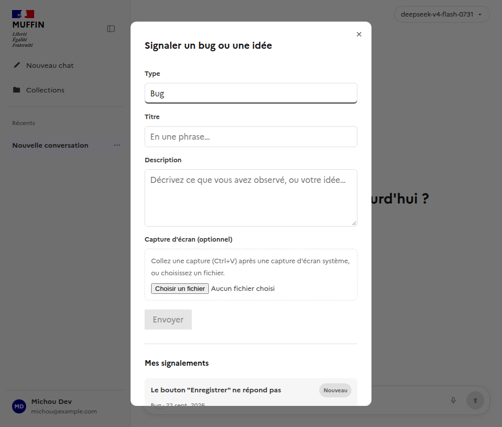
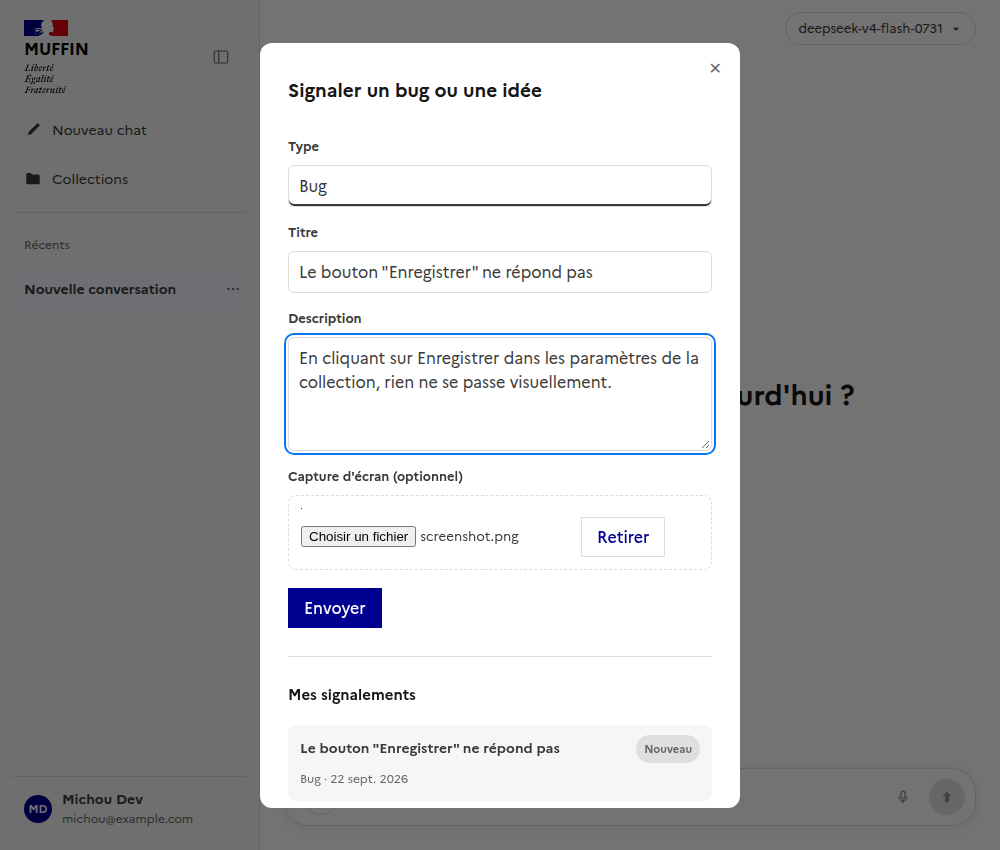
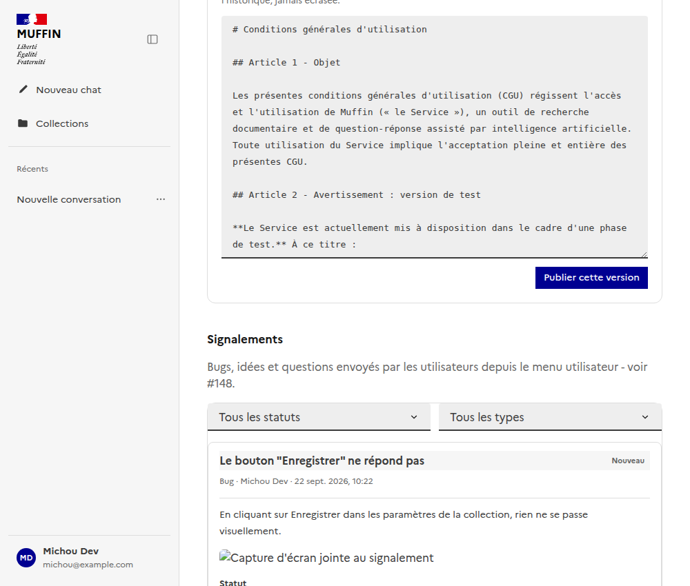
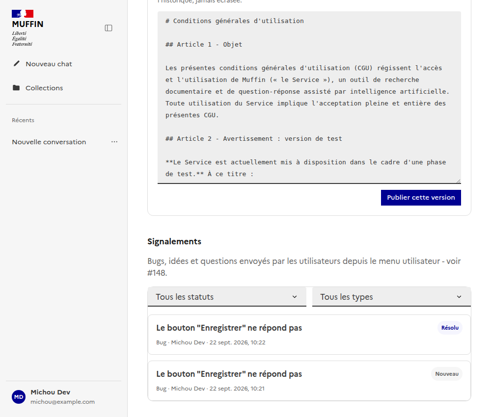
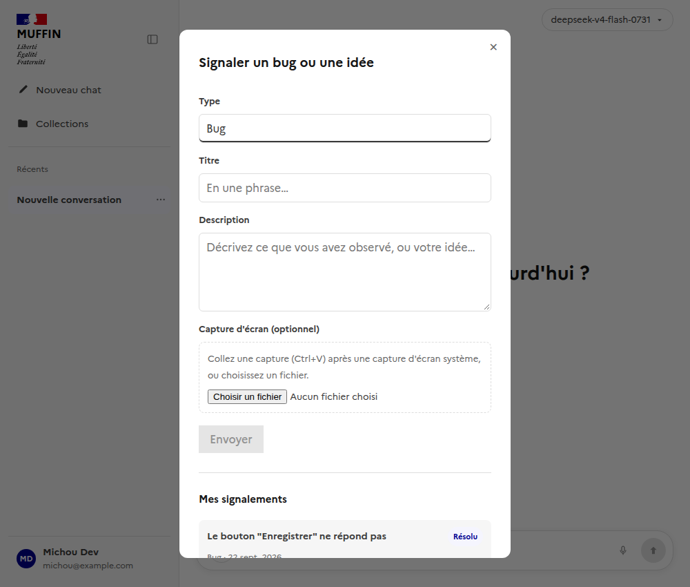

# Signalements : bug, idée, question (§148)

Documente le mécanisme de signalement libre - distinct du feedback 👍/👎 sur une réponse (attaché
à un run), un signalement n'est pas lié à une question posée à l'agent et suit son propre cycle
statut/réponse.

Composants Vue : [`frontend/src/components/ReportModal.vue`](../../../frontend/src/components/ReportModal.vue)
(formulaire + historique "Mes signalements", accessible depuis le menu utilisateur),
[`frontend/src/components/ReportsAdminSection.vue`](../../../frontend/src/components/ReportsAdminSection.vue)
(liste admin, filtrable, avec changement de statut et réponse - intégrée dans `AdminSettingsView.vue`).
Composables : [`useReports.ts`](../../../frontend/src/composables/useReports.ts),
[`useReportsAdmin.ts`](../../../frontend/src/composables/useReportsAdmin.ts).
Backend : `backend/app/models/report.py` (`Report`), `backend/app/services/report_service.py`,
`backend/app/routers/reports.py` (`POST/GET /reports`), `backend/app/routers/admin_reports.py`
(`GET/PATCH /admin/reports`).

## Signaler depuis le menu utilisateur

Un bouton "Signaler un bug ou une idée" ouvre une modal avec type (bug/idée/question), titre,
description, et une capture d'écran optionnelle - jointe via un fichier ou collée directement
depuis le presse-papier (Ctrl+V après une capture d'écran système, sans dépendance de capture DOM
côté client). L'historique "Mes signalements" reste visible en dessous, avec le statut et une
éventuelle réponse de l'équipe.

## Administration

Section "Signalements" de la page Administration : liste filtrable par statut/type, chaque entrée
dépliable pour voir la description complète, la capture d'écran jointe, changer le statut (nouveau
/ en cours / résolu / refusé) et répondre - une seule réponse par signalement en v1.

## Suivi côté utilisateur

Le statut et la réponse apparaissent directement dans "Mes signalements", sans action supplémentaire :

