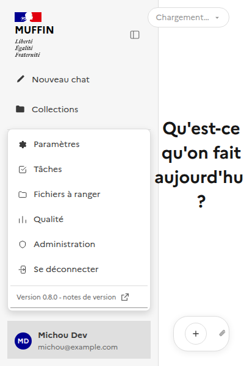

# Menu utilisateur — version de l'app (§128)

Documente l'affichage de la version dans le menu utilisateur (`ChatSidebar.vue`). Suit la même
logique que [`docs/ui/admin/`](../admin/README.md) - un sous-dossier par page/fonctionnalité.

Composant Vue : [`frontend/src/components/ChatSidebar.vue`](../../../frontend/src/components/ChatSidebar.vue).
Composable : [`useAppVersion.ts`](../../../frontend/src/composables/useAppVersion.ts) - lit
`GET /api/health` (déjà exposé, pas de nouvel endpoint - voir §128).

En bas du menu utilisateur, un lien "Version X.Y.Z - notes de version" ouvre le
[`CHANGELOG.md`](../../../CHANGELOG.md) du dépôt (généré par release-please) dans un nouvel
onglet GitHub - pas de rendu in-app, pas de nouvel endpoint backend pour ça non plus.

