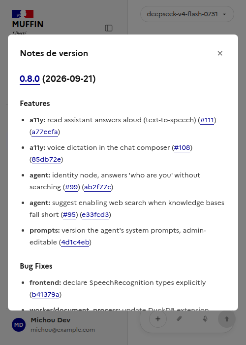

# Menu utilisateur — version de l'app + notes de version (§128)

Documente l'affichage de la version dans le menu utilisateur (`ChatSidebar.vue`) et la modale de
notes de version. Suit la même logique que [`docs/ui/admin/`](../admin/README.md) - un
sous-dossier par page/fonctionnalité.

Composants Vue : [`frontend/src/components/ChatSidebar.vue`](../../../frontend/src/components/ChatSidebar.vue),
[`frontend/src/components/ReleaseNotesModal.vue`](../../../frontend/src/components/ReleaseNotesModal.vue).
Composables : [`useAppVersion.ts`](../../../frontend/src/composables/useAppVersion.ts) - lit
`GET /api/health` (déjà exposé, pas de nouvel endpoint - voir §128) -
[`useChangelog.ts`](../../../frontend/src/composables/useChangelog.ts).

En bas du menu utilisateur, "Version X.Y.Z - notes de version" ouvre une modale affichant
uniquement la section de la version courante du [`CHANGELOG.md`](../../../CHANGELOG.md) du dépôt
(généré par release-please) - pas le fichier entier, qui grossit à chaque release et n'a pas de
raison d'être affiché en totalité ici. `useChangelog.ts` récupère le fichier brut directement
depuis `raw.githubusercontent.com` (dépôt public, CORS permissif, pas besoin de passer par le
backend - `CHANGELOG.md` vit à la racine du dépôt, hors du contexte de build Docker du backend)
et découpe tout ce qui précède le deuxième titre `## [` (release-please écrit toujours la version
la plus récente en premier). Un lien "Voir tout l'historique sur GitHub" en bas de la modale
renvoie vers le fichier complet pour qui veut remonter plus loin.

